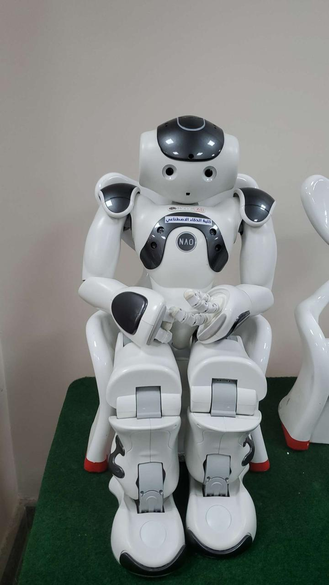

# Mimic-Nao



A real-time human pose estimation and NAO robot control system that allows a NAO robot to mimic human arm movements using computer vision.

## Overview

This project consists of two main components:

1. **Pose Estimation (`pose estimation.py`)**: Uses MediaPipe to detect human pose landmarks from a webcam feed and extracts arm joint coordinates (shoulder, elbow, wrist) for both left and right arms.

2. **NAO Robot Control (`NAO.py`)**: Controls a NAO robot to mimic the detected human arm movements by reading pose data and translating it to robot joint movements.

## Features

- Real-time human pose detection using MediaPipe
- Extraction of shoulder, elbow, and wrist coordinates for both arms
- NAO robot arm control with joint angle mapping
- Continuous pose tracking and robot movement synchronization
- Support for both left and right arm movements

## Requirements

### Hardware
- NAO robot (with network connectivity)
- Webcam for pose detection
- Computer with Python 3.x

### Software Dependencies

Install the required packages using:

```bash
pip install -r requirements.txt
```

The project requires:
- `opencv-python` - Computer vision and webcam capture
- `mediapipe` - Human pose estimation
- `pynaoqi` - NAO robot control SDK

## Setup

1. **Clone the repository**:
   ```bash
   git clone https://github.com/mostafaeslam/Mimic-NAO.git
   cd Mimic-Nao-main
   ```

2. **Install dependencies**:
   ```bash
   pip install -r requirements.txt
   ```

3. **Configure NAO robot connection**:
   - Edit `NAO.py` and update the `nao_ip` variable with your NAO robot's IP address
   - Ensure your computer and NAO robot are on the same network

## Usage

### Running Pose Estimation

Start the pose estimation system:

```bash
python "pose estimation.py"
```

This will:
- Open your webcam
- Display real-time pose detection with landmark visualization
- Save pose data to `output_file.txt` in real-time
- Press 'q' to quit

### Running NAO Robot Control

Start the NAO robot control system:

```bash
python NAO.py
```

This will:
- Connect to your NAO robot
- Read pose data from `output_file.txt`
- Control the robot's arm joints to mimic human movements
- Continuously update robot movements based on detected poses

### Running Both Systems

For full functionality, run both scripts simultaneously:

1. Start pose estimation in one terminal:
   ```bash
   python "pose estimation.py"
   ```

2. Start NAO control in another terminal:
   ```bash
   python NAO.py
   ```

## How It Works

### Pose Detection Process
1. Webcam captures video frames
2. MediaPipe processes each frame to detect human pose landmarks
3. Arm joint coordinates (shoulder, elbow, wrist) are extracted
4. Coordinates are written to `output_file.txt` in real-time

### Robot Control Process
1. NAO robot connects via network
2. Script reads pose data from `output_file.txt`
3. Coordinates are mapped to robot joint angles
4. Robot arm joints are controlled to mimic human movements
5. Process repeats continuously

## File Structure

```
Mimic-Nao-main/
├── pose estimation.py    # Human pose detection and tracking
├── NAO.py              # NAO robot control and movement
├── requirements.txt     # Python dependencies
└── README.md          # This file
```

## Configuration

### NAO Robot Settings
- **IP Address**: Update `nao_ip` in `NAO.py` with your robot's IP
- **Port**: Default port 9559 (usually doesn't need changing)
- **Speed**: Adjust `fraction_max_speed` for movement speed (0.0-1.0)

### Pose Detection Settings
- **Camera**: Default camera index 0 (change in `cv2.VideoCapture(0)`)
- **Resolution**: Currently set to 800x600 (modifiable in code)
- **Output File**: Pose data saved to `output_file.txt`

## Troubleshooting

### Common Issues

1. **NAO Connection Failed**
   - Verify robot IP address is correct
   - Ensure network connectivity between computer and robot
   - Check if NAO robot is powered on and connected

2. **Camera Not Working**
   - Ensure webcam is connected and not in use by other applications
   - Try changing camera index in `cv2.VideoCapture()`

3. **Pose Detection Issues**
   - Ensure good lighting conditions
   - Position yourself clearly in front of the camera
   - Check that MediaPipe is properly installed

4. **Robot Movement Problems**
   - Verify robot is in "Stand" posture
   - Check joint stiffness settings
   - Ensure robot has sufficient battery

## Safety Notes

- Always ensure the NAO robot has enough space to move safely
- Monitor the robot during operation to prevent collisions
- Keep emergency stop procedures ready
- Ensure robot is on a stable surface

## Contributing

Feel free to submit issues, feature requests, or pull requests to improve the project.

## License

[Add your license information here]

## Acknowledgments

- MediaPipe for pose estimation capabilities
- Aldebaran Robotics for NAO robot platform
- OpenCV for computer vision functionality 